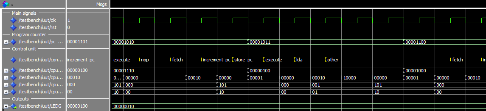
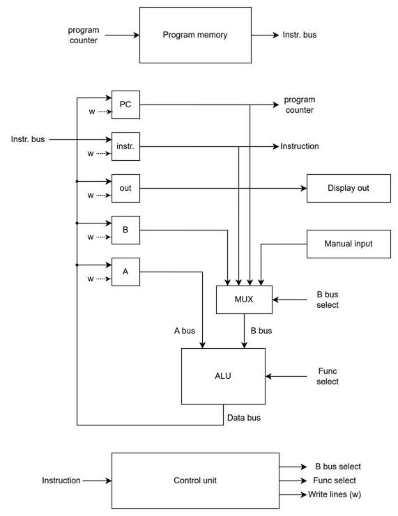
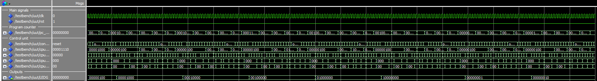
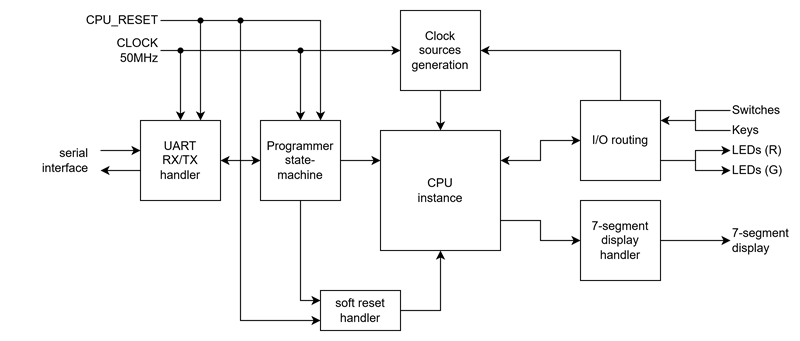

# Simple CPU for teaching microprocessor architecture

A simple CPU implemented in VHDL for the Altera Cyclone V GX Starter kit evaluation board. The CPU may either be controlled by an internal clock (slow/normal/fast settings) or cycled step-by-step (push button). A program is loaded by default but may be replaced at runtime via UART.

Execution states of the CPU are printed on the board's 7-segment display, the program counter is shown on the red LEDs and the CPU output register is shown on the green LEDs, which makes it easy to monitor and understand the execution flow of a program in a CPU. At the HDL level, control unit states are named and legible, which provides an additional level of legibility with RTL simulation.



This CPU uses a classic Von Neumann architecture with a few registers and a simple ALU. Its instruction set allows to run simple iterative programs with no branching or conditional statements. 

This implementation was inspired *"Step-by-Step Design and Simulation of a Simple CPU Architecture"* by Derek C. Schuurman (1). Some interpretations and key implementation choices differ from the original CPU description.

(1) : Schuurman, D. C. (2013, March). Step-by-step design and simulation of a simple CPU architecture. In Proceeding of the 44th ACM technical symposium on Computer science education (pp. 335-340). https://dl.acm.org/doi/pdf/10.1145/2445196.2445296

## CPU Architecture



The CPU uses a classic Von Neumann architecture, with 256B of memory, two general purpose registers (A, B) and an output register. Instructions are decoded in the control unit, that sequences all control signals (write lines to registers, B bus multiplexing selection, ALU function selection).

The control unit is a sequencer with its own microprogram memory, described in `tools/microprogram_generic_instr_set.txt`. This microcode described the sequence of control signals applied to the CPU for each instruction in its instruction set. A 4-step main directive at microprogram adresses 0x00-0x03 describes the elementary Fetch/decode/execute sequence and handles program counter incrementation.

This microprogram may be modified with a different instruction set and re-compiled with the provided tool (`tools/microcode_compiler.py`). The compiled microprogram used by the control unit is hardcoded in `vhd_sources/cpu/microprogram_memory.vhd`

## Instruction set

| Mnemonic   | opcode | Description                                        |
|------------|--------|----------------------------------------------------|
| `NOP`        |   0x04 | No operation                                       |
| `INPUT`      |   0x05 | Load manual input in register A (A <= manual input)| 
| `OUTPUT`     |   0x08 | Print A to output (output <= A)                    | 
| `JMP`        |   0x0B | Jump to specified PC (PC <= litteral)              | 
| `LDA`        |   0x0E | Load register A with direct value (A <= litteral)  | 
| `INC`        |   0x13 | Increment register A (A <= A+1)                    | 
| `MOV`        |   0x16 | Copy register A to register B (B <= A)             | 
| `ADD`        |   0x19 | Add registers A and B, store in A (A <= A + B)     | 
| `HALT`       |   0x1F | Halt program (PC <= HALT)                          | 

## Operation

By default, the CPU is loaded with a program that will Display a running light motif on the green LEDs



### Board controls

| I/O                     | Description                                               |
|-------------------------|-----------------------------------------------------------|
| CPU_RESET               | Active low reset input                                    |
| SW(9)                   | Manual/Automatic clock select (0 = automatic, 1 = manual) |
| SW(8)                   | Automatic clock speed select (0 = slow, 1 = fast)         |
| SW(7 downto 0)          | Manual input to CPU (when selected)                       |
| KEY(0)                  | Manual clock input (when selected)                        |
| KEY(3)                  | Ultra slow clock                                          |
| LEDR(9)                 | Indicates automatic clock state                           |
| LEDR(7 downto 0)        | Program counter state                                     |
| LEDG(7 downto 0)        | Output register state                                     |
| UART_(RX/TX)            | Reprogramming interface (send 'R' to start, and send 256 bytes to program memory) |

### UART interface

The CPU can be reprogrammed through UART interface : 
1. Send `R` via serial. This will place the CPU in the reset state and echo "R" to the serial terminal.
2. Send the 256 bytes of program memory, one byte at a time, in raw binary format. The board will send a `-` to acknowledge received data.
3. When 256 bytes of programming data are sent, the reset is lifted and the CPU resumes its operation

Example output of a successful reprogramming : 
```
R------------------------------------------------------------------------------------------------------------------------------------------------------------------------------------------------------------------------------------------------------------/
```

**UART settings :**
* Baudrate : 115200
* Data : 8 bits
* Parity : None
* Stop bits : 1
* Flow control : None

### Compiling new programs

New programs may be written in simplified assembly and assembled using the provided Python assembler.

Example program :

```
LDA 0xF1 # 1. Load 241 in register A
INC A    # 2. Increment register A
MOV B,A  # 3. Move A to B
LDA 0x0D # 4. Load 13 in register A
ADD A,B  # 5. Add A and B
OUTPUT   # 4. Print A (should be 255)
HLT      # 6. Halt program
```

Assemble the with the following command :

```
>>> python .\assembler.py -i .\asm_examples\multiplication_table.asm -o .\machine_code_examples\multiplication_table.raw -f raw
```

The assembler will print the machine code and write it to a binary file that you can then re-program the CPU with : 

```
Assembled Machine Code:
@0x00 : 0x0E 0xF1 0x13 0x16 0x0E 0x0D 0x19 0x08
@0x08 : 0x1F 0x00 0x00 0x00 0x00 0x00 0x00 0x00
@0x10 : 0x00 0x00 0x00 0x00 0x00 0x00 0x00 0x00
@0x18 : 0x00 0x00 0x00 0x00 0x00 0x00 0x00 0x00
@0x20 : 0x00 0x00 0x00 0x00 0x00 0x00 0x00 0x00
...
@0xF8 : 0x00 0x00 0x00 0x00 0x00 0x00 0x00 0x00
```

## HDL Architecture

